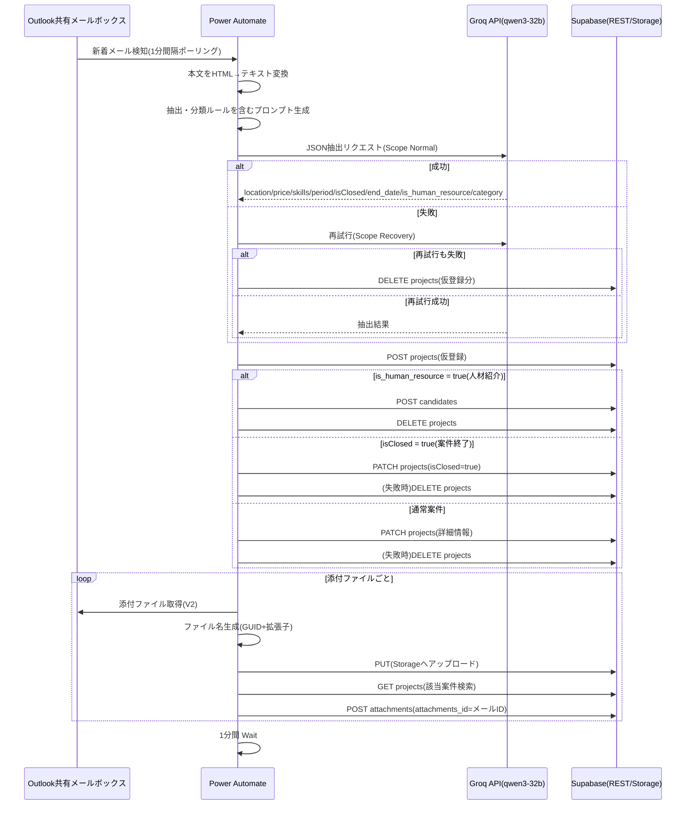
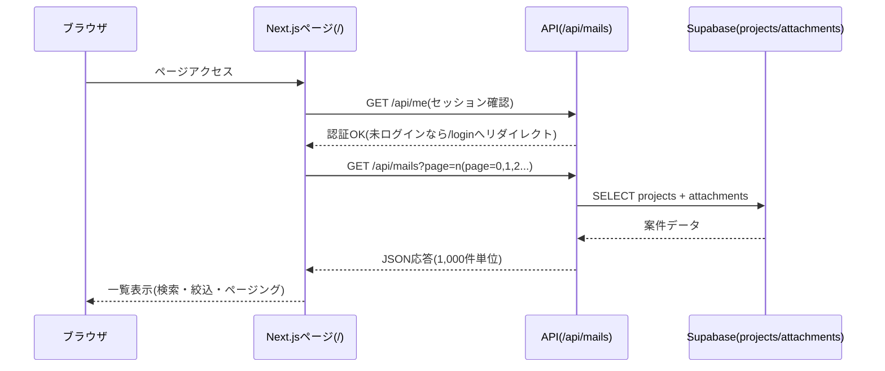
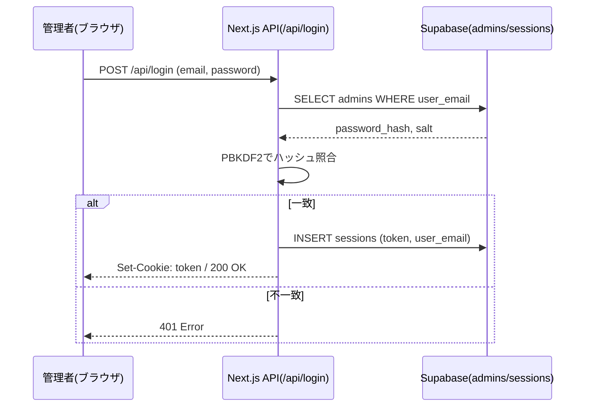
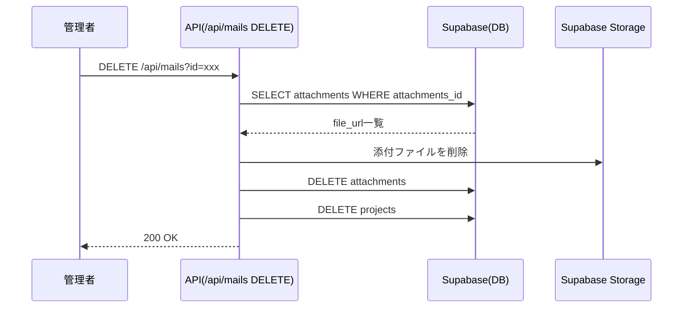
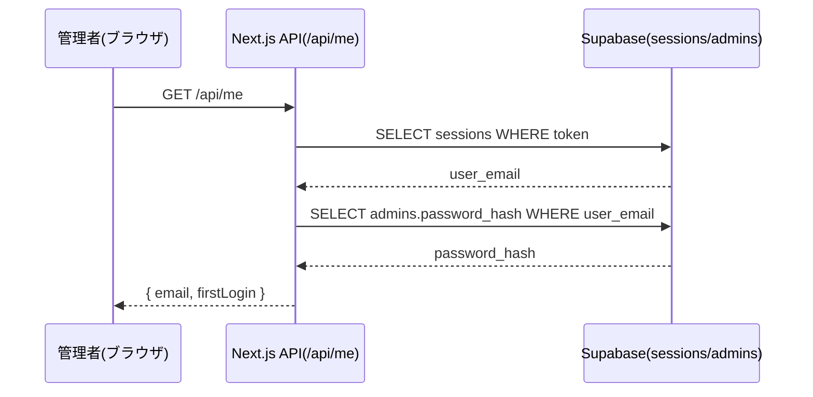
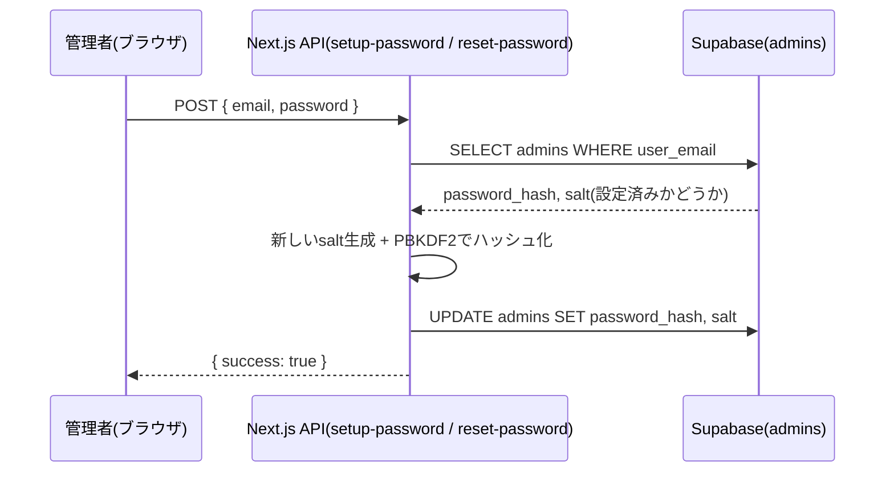
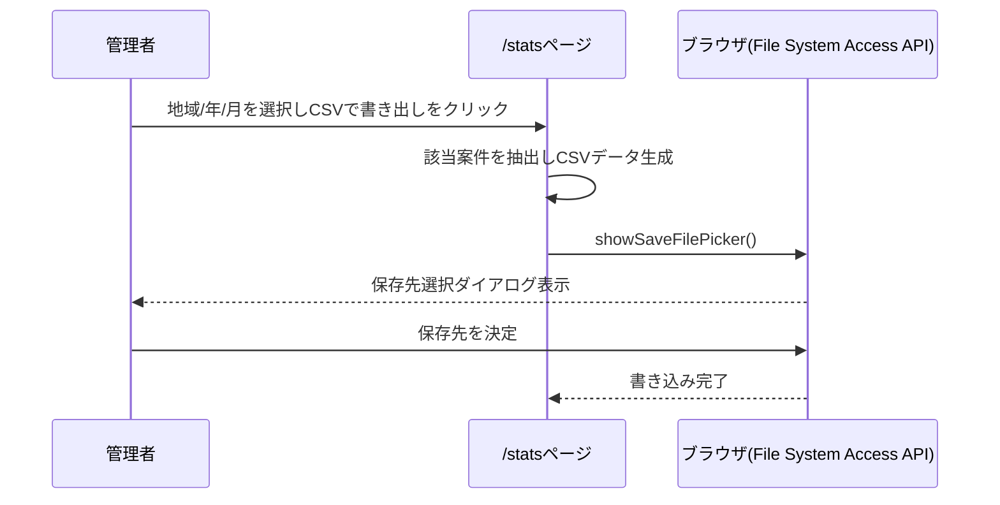
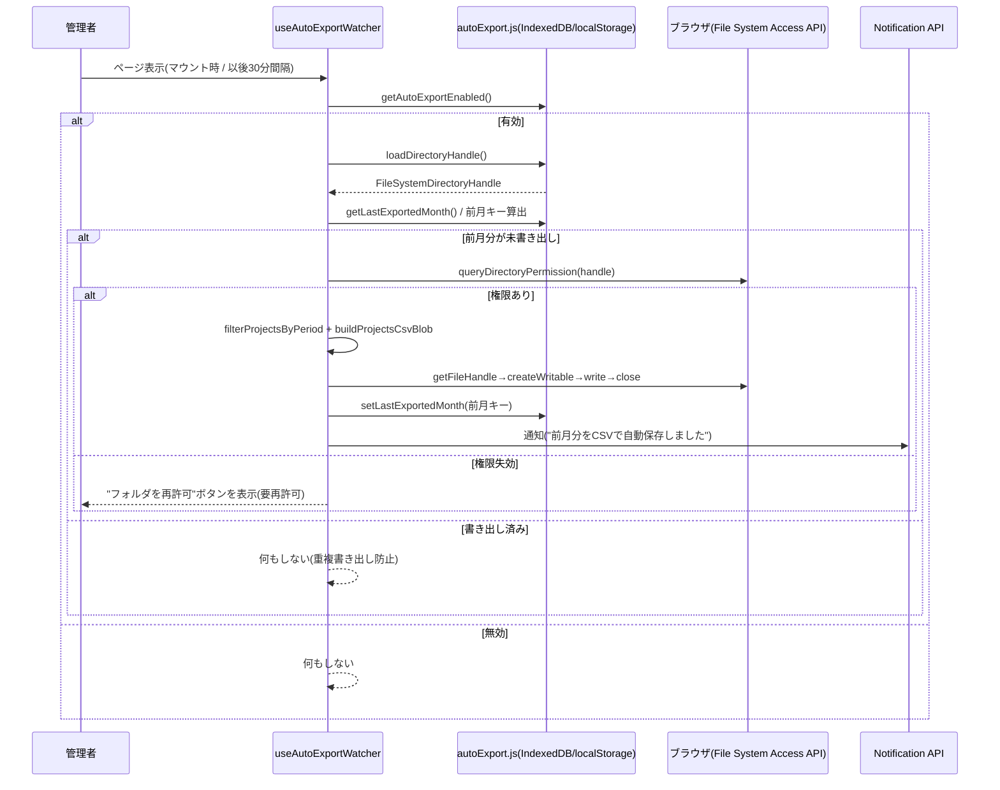

# 主要シーケンス

## 案件情報取込(Power Automate)



## 案件一覧取得



## ログイン



## 案件削除



## ログアウト

```mermaid
sequenceDiagram
  participant U as 管理者(ブラウザ)
  participant N as Next.js API(/api/logout)
  participant DB as Supabase(sessions)

  U->>N: POST /api/logout
  N->>DB: DELETE sessions WHERE token
  N-->>U: Set-Cookie: token=; Max-Age=0 / 200 OK
```

## セッション確認(/api/me)



## パスワード設定・リセット



## 統計グラフ書き出し(CSV例)



## CSV自動書き出し(月次・任意機能)



## 関連ドキュメント

- 図解付きの詳細: [設計書.docx](設計書.docx) 3章「詳細設計」
- Power Automateの分岐条件・異常系: [仕様書.docx](仕様書.docx) 1.4.1, 1.8, 5章
